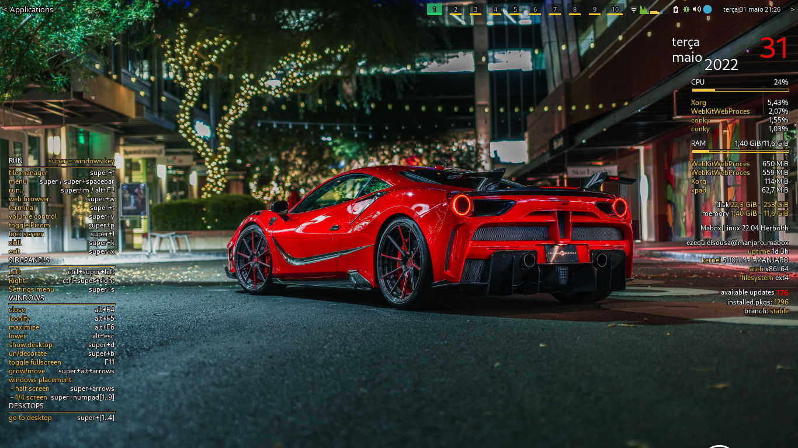

# Theme Tint2rc Collections

### Português

Clone o repositório para uma pasta local e copie o arquivo para <b>.config/tint2</b>. Entre o painel do tint2, desmarque o tema que você está utilizando atualmente e selecione o tema <b>tint2rc_activetop</b>.

##### tint2rc_activetop

